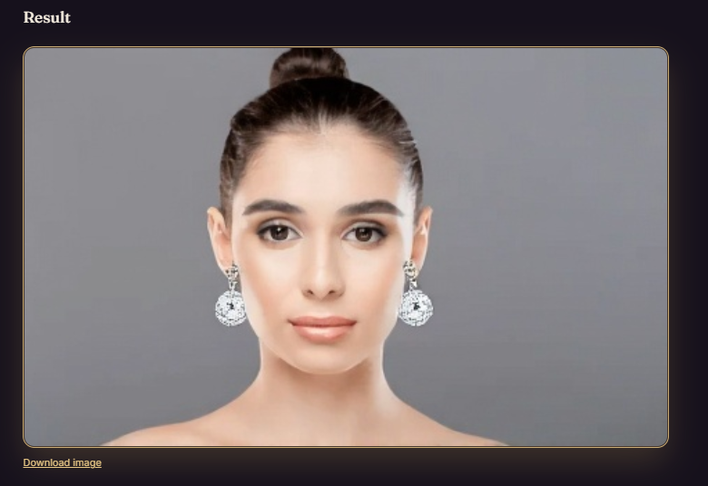
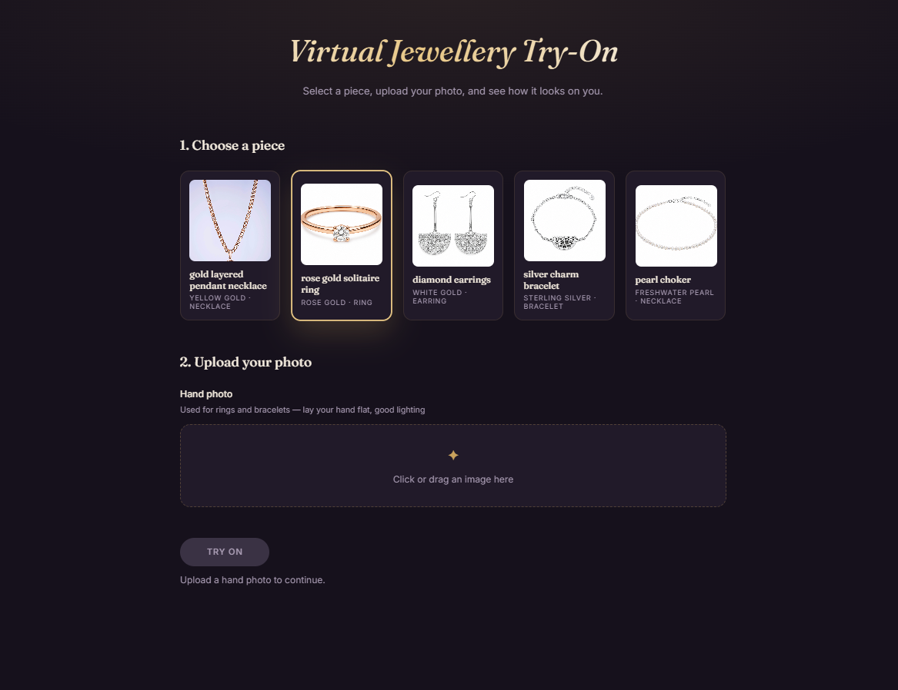
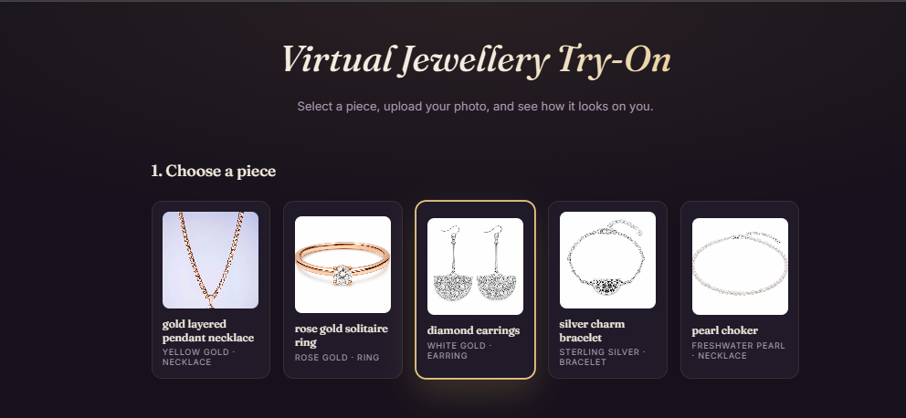
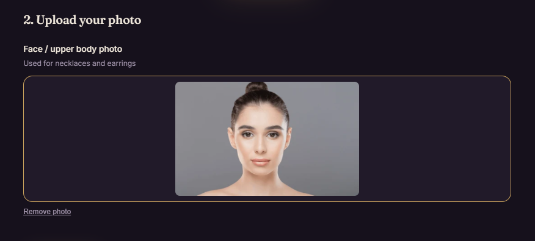

# Virtual Jewellery Try-On

Upload a photo, pick a piece, see it on you — in seconds.

A full-stack virtual try-on tool for jewellery: pick an item from the catalogue, upload a photo, and get a photorealistic AI-generated image of yourself wearing it.



---

## How it works

1. **Choose a piece** from the catalogue — necklaces, rings, earrings, bracelets.
2. **Upload a photo** — the app automatically asks for a face/upper-body photo or a hand photo depending on what you picked.
3. **See the reveal** — the backend builds a detailed prompt from the item's material and placement, and generates a real image of you wearing it.





---

## Tech Stack

- **Backend:** FastAPI (Python)
- **Image generation:** Hugging Face Inference API — [FLUX.1 Kontext](https://huggingface.co/black-forest-labs/FLUX.1-Kontext-dev), free tier, no billing required
- **Frontend:** React + Vite
- **Storage:** local filesystem only, no database

---

## Getting Started

### Backend

```bash
cd backend
pip install -r requirements.txt
```

Create `backend/.env`:

```
HF_TOKEN=your_huggingface_token_here
MOCK_MODE=false
```

Get a free token at [huggingface.co/settings/tokens](https://huggingface.co/settings/tokens), and accept the license on the [FLUX.1-Kontext-dev model page](https://huggingface.co/black-forest-labs/FLUX.1-Kontext-dev) before your token can use it.

Don't want to grab a token just to look around? Set `MOCK_MODE=true` instead — the app runs the full flow end-to-end and returns a placeholder result, no API calls made.

```bash
uvicorn app:app --reload
```
Runs at `http://localhost:8000`.

### Frontend

```bash
cd frontend
npm install
npm run dev
```
Runs at `http://localhost:5173`.

---

## The Prompt Engineering

`prompts.py` is the core of this project. The model is framed as a **retoucher, not a generator** — the prompt explicitly says this is a precise editing task, not a creative one, which keeps the model from redesigning the user's face or the jewellery instead of just compositing them. Each jewellery type also gets its own spatial placement instructions (how a ring wraps a finger, how a chain drapes a collarbone) and material-specific rendering hints (how gold catches light vs. how a pearl scatters it), because vague instructions produce vague results.

---

## A Note on the Journey

This started as a Gemini-powered pipeline — genuinely great results, until Google's free-tier image quota got cut to zero mid-build. Rather than shelve the project, the backend now runs on Hugging Face's free FLUX.1 Kontext model instead. The trade-off: FLUX edits based on the *text description* of a piece rather than seeing the exact product photo, so results are a little looser than Gemini's were — a fair price for zero cost.

---

## What Works

| Feature | Status |
|---|---|
| Catalogue loading | working |
| Photo upload with preview | working |
| Correct photo type per jewellery type | working |
| Prompt construction | working |
| Image generation (Hugging Face FLUX Kontext) | working |
| Mock mode for API-free demos | working |
